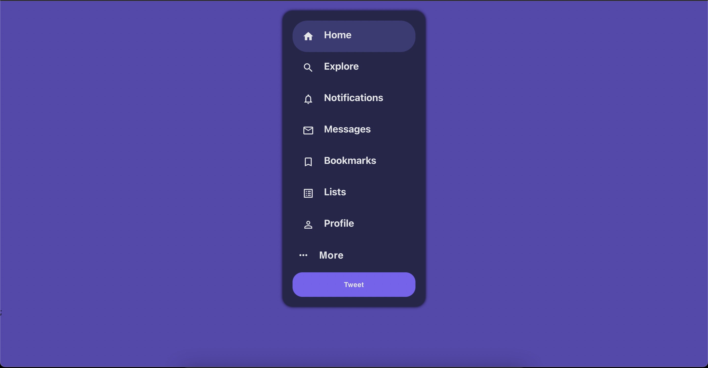

# Twitter Sidebar Component With Material UI and ReactJs - Dark Mode Version

_This project was followed by this [tutorial](https://blog.openreplay.com/building-a-twitter-sidebar-clone-with-material-ui-and-react), instead of making the light mode I made the dark mode version of it. Enjoy :)_

    

## Color Pallete

-  `#7962f2`
-  `#5647ae`
-  `#3b3b75`
-  `#26264c`
-  `#e4e5e6`

## Run Project

`npm start`

Runs the app in the development mode.\
Open [http://localhost:3000](http://localhost:3000) to view it in your browser.
